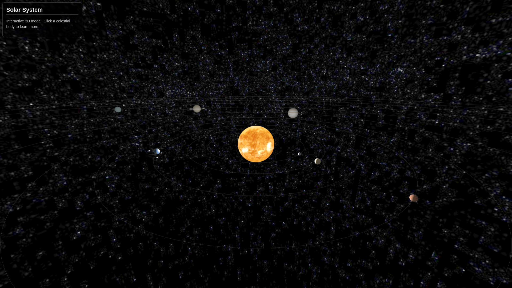
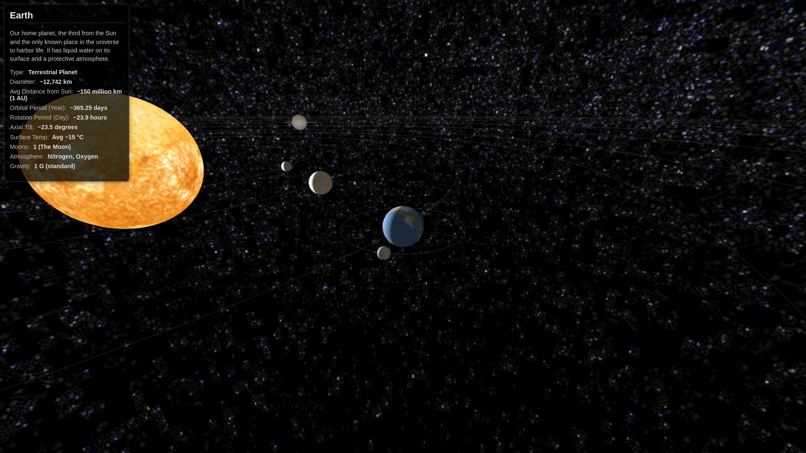

Okay, here is a comprehensive README.md file for your project. You can copy and paste this content into a file named README.md in the root directory of your project.

# Interactive 3D Solar System

A web application built with Three.js that renders an interactive 3D model of our solar system. Users can explore the planets, dwarf planets, and the Sun, click on them to focus the camera, and view detailed information about the selected celestial body.




## Features

- **3D Visualization:** Renders the Sun, all 8 planets (Mercury to Neptune), major dwarf planets (Ceres, Pluto, Eris), and Earth's Moon.
- **Orbital Representation:** Celestial bodies are placed in their correct relative orbital order around the Sun.
- **Visual Scaling:** Planets and the Sun have visually proportional radii (Note: distances and absolute sizes are scaled for viewability, not astronomical accuracy).
- **Starfield Background:** A panoramic star texture provides an immersive background.
- **Interactive Camera:** Use mouse or touch gestures to:
  - **Orbit:** Drag to rotate the view around the current focus point.
  - **Zoom:** Scroll wheel or pinch gesture to zoom in and out.
  - **Pan:** Right-click + drag or two-finger drag to move the camera parallel to the view plane.
- **Selection & Focus:**
  - Click (or tap) on a celestial body (Sun, planet, moon, dwarf planet) to select it.
  - The camera smoothly focuses on the selected body.
  - The camera will follow the selected body as it moves.
- **Information Display:** An info panel displays details about the currently selected body or general Solar System information by default.
- **Realistic Motion (Visual):**
  - Planets orbit the Sun and moons orbit their parent planets at relative speeds.
  - Planets rotate on their axes.
  - Includes retrograde (backward) rotation for Venus.
  - Includes axial tilt for Uranus (rotates on its side).
  - Global speed multiplier to adjust the simulation pace.
- **Modular Code:** The JavaScript code is organized into logical modules for better maintainability.
- **Responsive:** Basic resize handling to adapt the canvas to the window size.

## Technology Stack

- HTML5
- CSS3
- JavaScript (ES6 Modules)
- [Three.js](https://threejs.org/) (r161 or compatible) - Core 3D library
  - `OrbitControls` for camera interaction

## Prerequisites

- A modern web browser with WebGL support (Chrome, Firefox, Safari, Edge).
- [Node.js](https://nodejs.org/) and npm (or yarn) installed to run a local development server. This is required because the project uses ES6 modules.

## Installation & Setup

1.  **Clone or Download:**

    - Clone the repository: `git clone https://github.com/Mordris/SolarSystemThreeJS.git`
    - OR download the project files as a ZIP and extract them.

2.  **Navigate to Directory:**

    ```bash
    cd path/to/your-project-folder
    ```

3.  **Add Textures:**

    - Create a folder named `textures` inside the project directory.
    - **IMPORTANT:** You need to obtain texture images for the celestial bodies and the starfield background. Good sources include NASA image galleries, Solar System Scope Textures, or other planet texture resources. Ensure you have the rights to use them.
    - Place the following texture files (or your equivalents) inside the `textures/` folder:
      - `sun_texture.jpg`
      - `mercury_texture.jpg`
      - `venus_texture.jpg`
      - `earth_texture.jpg`
      - `moon_texture.jpg`
      - `mars_texture.jpg`
      - `ceres_texture.jpg`
      - `jupiter_texture.jpg`
      - `saturn_texture.jpg`
      - `saturn_ring_texture.png` (needs transparency)
      - `uranus_texture.jpg`
      - `neptune_texture.jpg`
      - `pluto_texture.jpg`
      - `eris_texture.jpg`
      - `starfield_texture.jpg` (a large panoramic/cubemap texture)

4.  **Run Local Server:**

    - Open your terminal or command prompt in the project directory.
    - Use `npx` (comes with npm 5.2+) to run a simple HTTP server:
      ```bash
      npx serve
      ```
    - (Alternatively, if you have another server like `http-server` installed globally: `http-server`)
    - The terminal will output a local URL, usually `http://localhost:3000` or `http://localhost:8080`.

5.  **Open in Browser:**
    - Open your web browser and navigate to the local URL provided by the server (e.g., `http://localhost:3000`).

## Usage

- **Explore:** Use your mouse (drag, scroll, right-click+drag) or touch gestures (drag, pinch, two-finger drag) to navigate the solar system view.
- **Select & Learn:** Click or tap on any planet, the Sun, the Moon, Ceres, Pluto, or Eris. The camera will move to focus on it, follow its movement, and the info panel on the left will update with details about that body.
- **Switch Focus:** Simply click or tap on a different celestial body to change the selection and camera focus.

## File Structure

SolarSystem/
├── index.html # Main HTML structure
├── style.css # CSS styling for layout and info panel
├── main.js # Main application entry point, orchestrates modules
├── sceneSetup.js # Initializes Scene, Camera, Renderer, Controls, Lighting
├── data.js # Contains the solarSystemData array and configuration
├── celestialBodyUtils.js # Functions to create 3D objects (planets, moons, etc.)
├── interaction.js # Handles user input (clicks, taps), selection, info panel updates
├── animation.js # Contains the main animation loop and resize handler
└── textures/ # Folder containing all required texture images
├── sun_texture.jpg
└── ... (other textures)

## Potential Future Improvements

- Implement more accurate orbital elements (elliptical orbits, inclination).
- Add more moons for gas giants like Jupiter and Saturn.
- Visualize the asteroid belt more explicitly.
- Use more detailed textures (normal maps, specular maps) for better visual fidelity.
- Optimize performance for smoother rendering (Level of Detail, Instancing).
- Enhance the UI/UX of the information panel.
- Implement accurate tidal locking for the Moon's rotation.
- Add atmospheric effects (e.g., Earth's blue glow).
